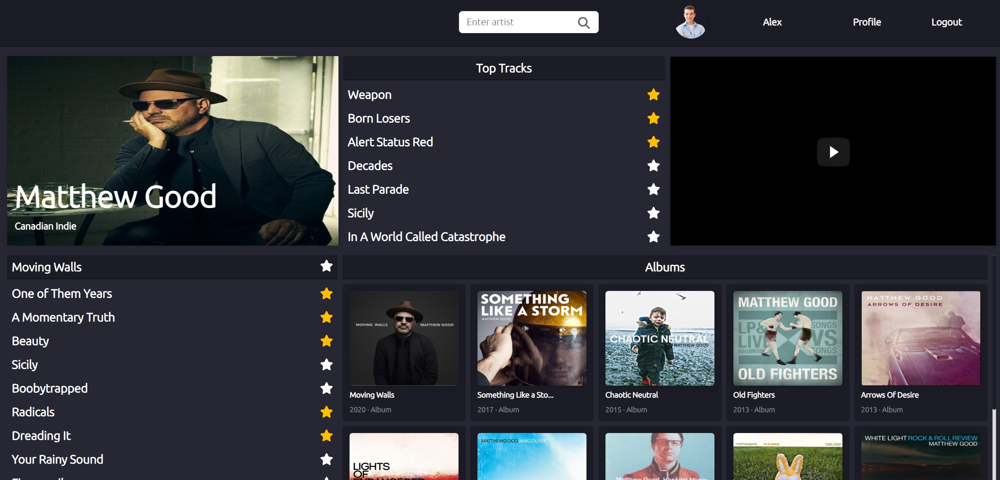
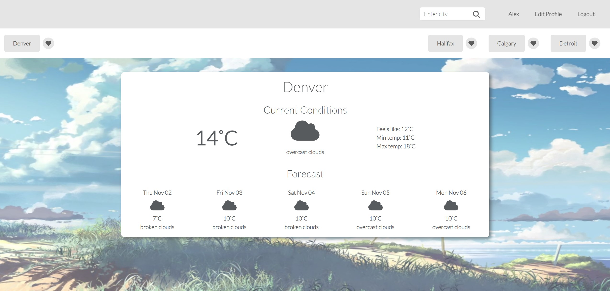
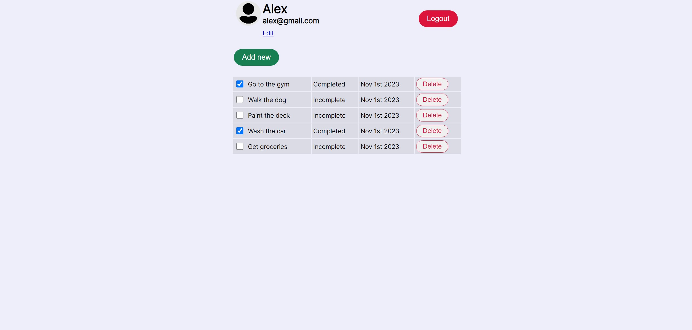
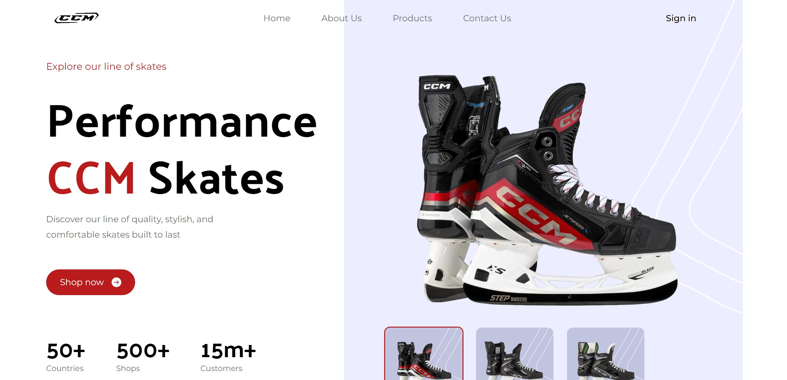

  
  
  
  <!--  -->
  

Driven, detail-oriented, professional with a well rounded set of skills across diverse industries. Equipped with over a decade’s worth of experience in team and project management. Seeking a tech company to hone my skills as a developer and contribute in a meaningful way.

See [my website](https://evanearle.com) for more information!

<h1 align="center">Projects</h1>
<table bordercolor="#66b2b2">
  
  <tr>
    <td width="50%" valign="top">
      <h3 align="center">Soundbloom</h3>
         
        
         
       
 

   <!--    -->
  
      

<strong>React, Express, Node.js, MongoDB</strong> - Music player where users can search and play their favourite artists, find similar artists, and set their tracks to a favourites playlist. 

    </td>

<td width="50%" valign="top">
      <h3 align="center">WeatherCheck</h3>
         
      
         
        

          
  <!--  -->
  
      

        
<strong>React, Express, Node.js, MongoDB</strong> - A weather app to track forecasts and set your favourite locations.

    </td>
  </tr>
  
  <tr>
    <td width="50%" valign="top">
      <h3 align="center">TaskEase</h3>
       
        
       
        

  
      

        
<strong>React, Express, Node.js, MongoDB</strong> - An app to track daily tasks.

    </td>
     <td width="50%" valign="top">
      <h3 align="center">CCM Landing Page</h3>
       
        
       
        

  
      

        
<strong>React, Tailwind CSS</strong> - A product landing page for CCM.

    </td>
  </tr>
    
 
</table>

<h1 align="center">Technologies</h1>

    
    
    
    
    
    
    
    
    
    
 

---

<h1 align="center">Connect</h1>

  
  
  
  <!--  -->
  

