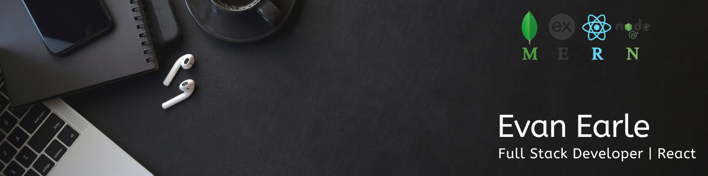

  
  
  
  <!--  -->
  

Full stack developer with experience in both large-scale projects and building smaller applications from scratch. Skilled in building APIs and responsive design working with React, Redux, Node, Express, MongoDB, Javascript, Typescript, HTML, and CSS. Comfortable working independently or collaborating in teams with several years of experience working remotely.

𝐋𝐚𝐧𝐠𝐮𝐚𝐠𝐞𝐬: JavaScript, TypeScript, HTML, CSS 
𝐅𝐫𝐚𝐦𝐞𝐰𝐨𝐫𝐤𝐬/𝐋𝐢𝐛𝐫𝐚𝐫𝐢𝐞𝐬: React.js, Node.js, Express.js, Next.js, Redux, Socket.io, Tailwind CSS, SASS, Bootstrap, Material-UI 
𝐃𝐚𝐭𝐚𝐛𝐚𝐬𝐞𝐬: MongoDB 
𝐂𝐥𝐨𝐮𝐝 𝐏𝐥𝐚𝐭𝐟𝐨𝐫𝐦𝐬: Firebase, AWS, Heroku, Netlify, Hosting Providers 
𝐓𝐞𝐬𝐭𝐢𝐧𝐠: Jest, Postman, React Testing Library, Unit Testing, Functional Testing, Developer Tools 
𝐎𝐭𝐡𝐞𝐫 𝐒𝐤𝐢𝐥𝐥𝐬: Git, Github, Docker, VSCode, NPM, Vite, Webpack, REST APIs, CRUD operations, Mongoose, REST APIs, Cloudinary, Agile Methodology, Scrum, JWT, OOP

See [my website](https://evanearle.com) for more information!

<h1 align="center">Projects</h1>
<table bordercolor="#66b2b2">
  
  <tr>
     <td width="50%" valign="top">
      <h3 align="center">FilmFindr</h3>
       
        
       
        

  
      

        
<strong>React & Context API, Node/Express, MongoDB, Tailwind CSS</strong> - A full stack movie catalogue application that displays the latest popular movies along with their details, a watchlist feature, and the ability to search movies.

    </td>
    

   <td width="50%" valign="top">
      <h3 align="center">Skyward</h3>
         
      
         
        

  
      

        
<strong>React, Express, Node.js, MongoDB, Socket.IO, TailwindCSS</strong> - A chat app to talk to your friends in real time one on one or in groups.

    </td>

    

  </tr>
  
  <tr>
    <td width="50%" valign="top">
      <h3 align="center">Soundbloom</h3>
         
        
         
       
 

   <!--    -->
  
      

<strong>React, Express, Node.js, MongoDB</strong> - Music player where users can search and play their favourite artists, find similar artists, and set their tracks to a favourites playlist. 

    </td>
     <td width="50%" valign="top">
      <h3 align="center">Diagnosix.ai</h3>
       
        
       
        

  
      

        
<strong>AI-powered medical web application designed for healthcare professionals to perform differential diagnoses, built with Next.js, MongoDB, OpenAI API, Auth.js, and Tailwind CSS.

    </td>
  </tr>
    
 
</table>

<h1 align="center">Technologies</h1>

    
    
    
    
    
    
    
    
    
    
 

---

<h1 align="center">Connect</h1>

  
  
  
  <!--  -->
  

